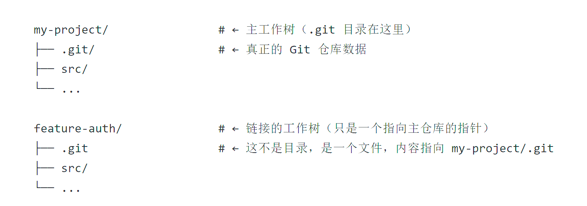

## Learn:
单项目多任务并行开发解决方案:
Git worktree，允许同一个仓库同时拥有多个独立的工作目录，有独立的文件和暂存区，可检出不同分支，但共享同一个.git 文件数据。
具体表现如下：

worktree相当于该仓库在本地的一次副本，只独立分支、工作文件和暂存区，共享git历史，一次fetch，所有worktree同步。
比clone快，操作方便、占用存储小、即用即删。

当然，多任务也可在一个分支上进行开发，但存在如下问题：
1.任务必须串行开始，否则提交范围不清。
2.若强制并行，单次提交包含多项任务，git管理混乱，回滚风险大。
3.若多次提交，必然存在checkpoint污染，一旦旧提交存在重大bug，当前分支新实现不管是revert（回退新实现）还是reset（永久丢失新实现），都非优解。
4.测试覆盖率失真，旧提交接待新实现‘死代码’，而导致无法通过PR。
5.实现易覆盖，导致文件冲突。

请注意，虽然3、4、5随着模型能力提升以有明显改善，但仍然存在风险。